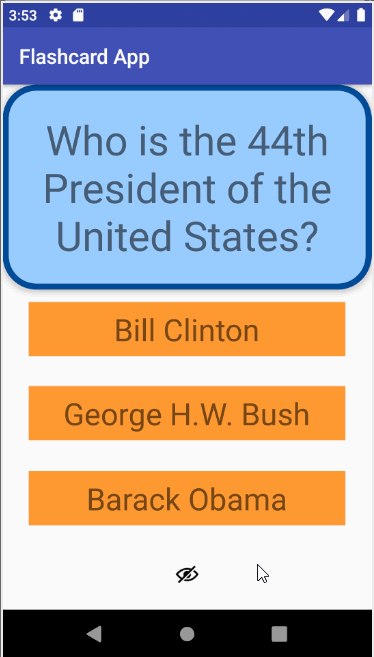

## FlashCardApp (Saving Cards)

### App Description
This is an android application that is used to simulate a Flashcard.

## Lab 1

### Required
- [x] Create New Project in Android Studio
- [x] Add a view for the front side of the flashcard to display the question
- [x] Add a view for the back side of the flashcard to display the answer
- [x] Build in logic to show the answer side when the card is tapped
- [x] Push code to GitHu
### Optional
- [x] toggle the flashcard between the question side and the answer side
- [x] Style the question and answer side of the card to better distinguish between the two sides
- [x] Add selectable multiple choice answers beneath the card
   - [x] Change the background color of the multiple choice answers when clicked to indicate whether the question waanswered correctly
- [x] Further customize and style the card

## GIF Walkthrough

 
